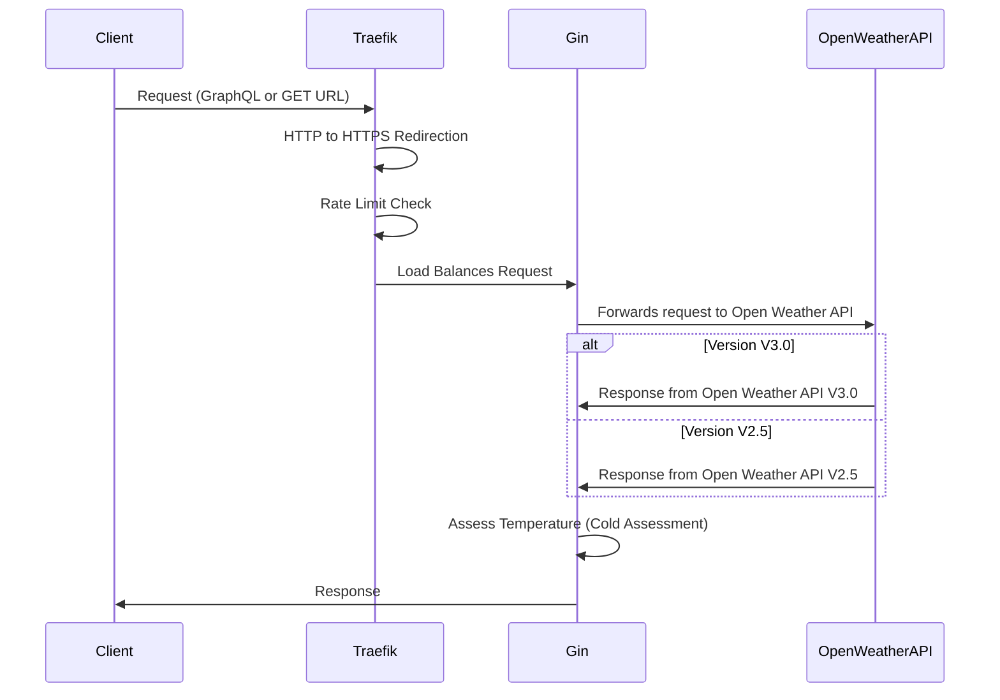

# Weather API Project

# TL;DR

If you want to run the application directly

```bash
# sync dependencies
go generate ./...
go run main.go
```

Just use `localhost:8080` with the routes below to access the application.

If you want to use docker-compose

```bash
docker-compose up --build 
```

```plaintext
Add gin-app.local to your /etc/hosts file
```

Navigate to `https://gin-app.local/ping`. Other routes that are active for this application are shown below.
You will have to replace `YOUR_OPEN_WEATHER_API_KEY` with your own Open Weather API key. Please not the onecall V3.0 API
requires a paid subscription to Open Weather API.

1) http://gin-app.local:3000 # Grafana
2) http://gin-app.local:9093 # Alertmanager
3) http://gin-app.local:9090 # Prometheus
4) http://gin-app.local:8080 # Traefik Dashboard
5) Version 3.0 onecall API for Current
   Weather - http://gin-app.local/weather/v30/currentWeather?lat=38.89511&lon=-77.03637&appid=YOUR_OPEN_WEATHER_API_KEY&units=imperial&lang=en
6) Version 3.0 onecall API for Daily
   Summary - http://gin-app.local/weather/v30/dailySummary?lat=38.89511&lon=-77.03637&date=2024-02-17&appid=YOUR_OPEN_WEATHER_API_KEY&units=imperial&lang=en
7) Version 3.0 onecall API for
   TimeMachine - http://gin-app.local/weather/v30/timeMachine?lat=38.89511&lon=-77.03637&dt=1643803200&appid=YOUR_OPEN_WEATHER_API_KEY&units=imperial&lang=en
8) Version 2.5
   API - http://gin-app.local/weather/v25/currentWeather?lat=38.89511&lon=-77.03637&appid=YOUR_OPEN_WEATHER_API_KEY&units=imperial&lang=en

## If you are want to know more please read below

This project leverages the power of the Gin server for backend operations, providing a robust and efficient handling of
weather-related data queries. It's designed to be flexible, with deployment configurations for Containerized
environment.

## Key Components

- **Gin Server**: Utilized for the backend to process and respond to API requests efficiently.
- **Docker Deployment**: Includes a `Dockerfile` and `docker-compose.yml` for easy deployment, showcasing a sample setup
  that can be run locally or in a containerized environment.
- **Local and Containerized Setup**: Run the service directly on `localhost:8080` to access the Gin server, or deploy
  using `docker-compose.yml` to include a full stack with Traefik reverse proxy, Prometheus, Grafana, Traefik dashboard,
  and Alertmanager.

## Supported Features

- **Flexible Backend**: The Gin server is at the core of the backend operations.
- **Weather API Versions**: Supports both v2.5 and v3.0 of the Open Weather API, allowing for varied data access.
- **Rate Limiting**: Ensures fair use and stability of the service under load by limiting request rates.
- **HTTP to HTTPS Redirect**: Automatically redirects HTTP traffic to HTTPS, enhancing security.
- **Load Balancing**: Distributes incoming requests efficiently across multiple instances.
- **GraphQL Interface**: Offers a GraphQL endpoint for more flexible data querying.

## Getting Started

To run this project locally:

1. **Directly with Gin Server**: Navigate to the project directory and run `go generate ./... ; go run main.go` to start
   the Gin server
   on `localhost:8080`.
2. **Using Docker Compose**: Run `docker-compose up` to spin up the full stack, including the Traefik reverse proxy
   setup and monitoring tools.

For deploying to Kubernetes, convert the `docker-compose.yml` to Kubernetes manifests using tools like Kompose, and
apply them to your cluster.

## Monitoring and Management

Access the Traefik dashboard for an overview of the routing configurations and services, and use Prometheus and Grafana
for monitoring metrics and setting up alerts through Alertmanager.

---

Explore the GraphQL interface at `http://localhost:8080/query` for interactive queries and to leverage the full
capabilities of the supported Weather API versions.

Deployment using docker-compose

## Deployment Using Docker Compose

Deploying the application with Docker Compose streamlines the setup process, ensuring all components—including the Gin
server, Traefik reverse proxy, Prometheus, Grafana, and Alertmanager—are properly configured and interconnected. This
guide walks you through the deployment process, focusing on HTTPS setup with self-signed certificates (test certs are
already included if you just want to skip this step).

### HTTPS and Certificates (optional; already comes with self-signed certs found in the ./certs directory)

This project uses self-signed certificates to secure communications via HTTPS. For simplicity and ease of setup, we're
including these certificates in the repository. If you're looking for a more robust solution for a production
environment, integrating Let's Encrypt with Traefik for automatic certificate management is a recommended enhancement.

1. **Using Included Certificates**:
    - The repository comes with pre-generated self-signed certificates for `gin-app.local`. There's no need to generate
      new ones unless you want to customize your setup or refresh the certificates.

2. **Accessing the Application**:
    - Since we're using `gin-app.local` as the host, you'll need to ensure your system recognizes this hostname and
      routes it to your local machine. The easiest way to achieve this is by adding an entry to your `/etc/hosts` file.
   ```plaintext
   127.0.0.1   gin-app.local
   ```

This step is crucial for accessing the website using the correct host, especially when using tools like curl that allow
specifying hosts directly. For web browsers and most other use cases, editing the /etc/hosts file simplifies access.

### HTTP to HTTPS Redirection:

The Traefik server is configured to automatically redirect HTTP traffic to HTTPS, leveraging the self-signed
certificates. This ensures all communications are encrypted without requiring manual intervention.

### Starting the Application

To deploy and start the application using Docker Compose:
Navigate to the root directory of the project where the docker-compose.yml file is located.
Run the following command to build and start the services:

```bash
docker-compose up --build 
```

This command builds the Go project and runs it inside Docker, alongside the other services defined in the
docker-compose.yml.

After starting the services, you can access the application via https://gin-app.local/ping
in your web browser or use curl with the --insecure flag to bypass SSL validation for testing:

```bash
curl --insecure https://gin-app.local/ping
```

Remember, since we're using self-signed certificates, web browsers will likely warn you about the site's security
certificate. You can proceed past this warning in development environments.

If you want use your own certificates, you can generate them using the following command: (Optional)

```bash
openssl req -x509 -nodes -days 365 -newkey rsa:2048 -keyout gin-app.local.key -out gin-app.local.crt -subj "
/CN=gin-app.local"
```

# Additional Details

Simple sequence diagram to show the flow of the application




